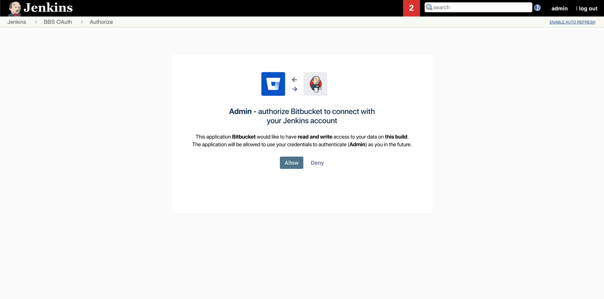

## Introduction
Since version 2.0.1, this plugin allows Jenkins to act as OAuth provider for Bitbucket Server. Admin can now
add Jenkins as an applink. This allows users to run various Jenkins operation from within Bitbucket 
Server.   

## Why OAuth Provider
Other options like API keys/tokens required users to pre-configure their tokens before they can run operations from Bitbucket Server. 
Being OAuth provider allow users to participate in 3 legged OAuth dance. The result is an access token, that can be used as bearer token for authentication.

In the future, Applink module (in package `com.atlassian.bitbucket.jenkins.internal.applink` ) can also be promoted as a library. 

## Applink module
1. Every HTTP request passes through the `com.atlassian.bitbucket.jenkins.internal.applink.oauth.serviceprovider.auth.OAuth1aRequestFilter` filter.
2. For an Underlying system, an implementation of `com.atlassian.bitbucket.jenkins.internal.applink.oauth.serviceprovider.auth.TrustedUnderlyingSystemAuthorizerFilter` 
can be provided which handles the login. `TrustedJenkinsAuthorizer` does it for Jenkins.
3. Expose Rest endpoint in the underlying system to generate request tokens (delegate to RequestTokenRestEndpoint) and access tokens (delegate to AccessTokenRestEndpoint). Those 
endpoint should delegate to 
    - `com.atlassian.bitbucket.jenkins.internal.applink.oauth.serviceprovider.rest.RequestTokenRestEndpoint` for Request token generation
    - `com.atlassian.bitbucket.jenkins.internal.applink.oauth.serviceprovider.rest.AccessTokenRestEndpoint` for access token generation
4. For the 3-legged OAuth dance, you need an authorization screen similar to the one shown below. In it, the user needs to authorize an incoming request. As for the Jenkins authorization screen, this is handled by 
`com.atlassian.bitbucket.jenkins.internal.jenkins.oauth.servlet.AuthorizeConfirmationConfig`.
       
5. You also need to provide a secure way to store tokens by providing an implementation of these classes:
    - `com.atlassian.bitbucket.jenkins.internal.applink.oauth.serviceprovider.token.ServiceProviderTokenStore`
    - `com.atlassian.bitbucket.jenkins.internal.applink.oauth.serviceprovider.consumer.ServiceProviderConsumerStore`
6. On the Atlassian tool side, you can use the Applink API.