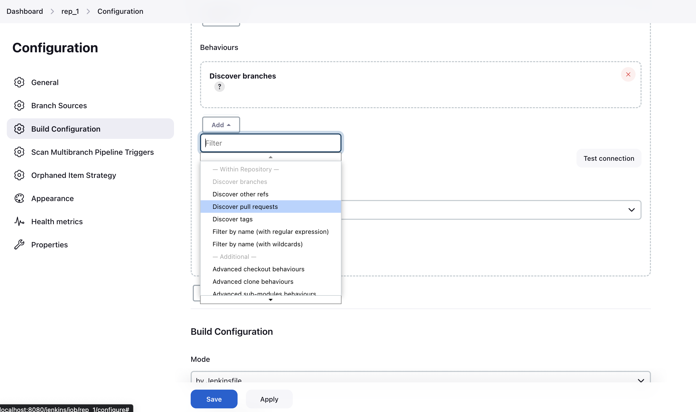
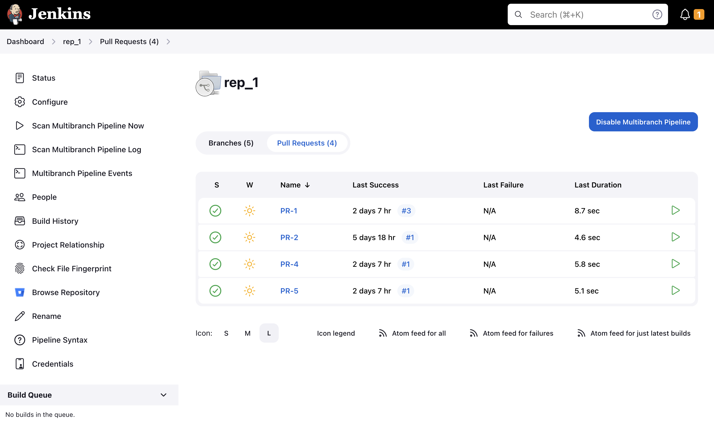

# Pull Request Discovery Behavior for Multibranch Pipeline Jobs

## Overview

As of version 4.0.0-alpha.1 of this plugin, we have added a new pull request discovery behavior for Multibranch Pipeline jobs. This behavior allows the job to discover open pull requests in Bitbucket Server and schedule builds for each individual pull request.

NOTE: Forked (cross-repository) pull requests are not supported as part of the alpha release.

## Configuration

To enable this new feature, simply follow the steps below:

1. Navigate to your Jenkins instance and open the configuration page for your Multibranch Pipeline job.
2. Go to the "Branch Sources -> Bitbucket Server" section.
3. Under "Behaviors", click "Add" and then select "Discover pull requests". This will enable the job to discover open pull requests in your Bitbucket Server.
   
4. Save your configuration changes.
5. You should now be able to see builds for open pull requests targeting the specified repository.
   
