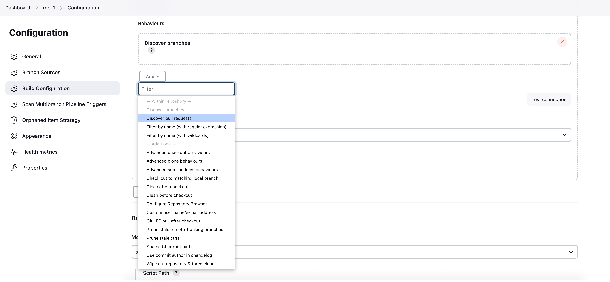

# Pull Request Discovery Behavior for Multibranch Pipeline Jobs

## Overview

As of version 4.0.0 of this plugin, we have added a new pull request discovery behavior for Multibranch Pipeline jobs. This behavior allows the job to discover open pull requests in Bitbucket Server and schedule builds for each individual pull request.

## Configuration

To enable this new feature, simply follow the steps below:

1. Navigate to your Jenkins instance and open the configuration page for your Multibranch Pipeline job.
2. Go to the "Branch Sources -> Bitbucket Server" section.
3. Under "Behaviors", click "Add" and then select "Discover pull requests". This will enable the job to discover open pull requests in your Bitbucket Server.
   
4. Additionally, if you want to trigger pull request builds via a webhook from Bitbucket, go to the "Scan Multibranch Pipeline Triggers" section, then make sure "Bitbucket webhook trigger -> Pull request opened or source branch updated" is enabled. This triggers a pull request scan after a pull request is opened, it also updates builds by disabling builds after a pull request is declined, deleted, or merged. 
5. Save your configuration changes.
6. You should now be able to see builds for open pull requests targeting the specified repository.
   

**Note**
Enabling both "Discover pull requests" AND "Discover branches" will create two builds for each pull request, one branch build and one pull request build. It is generally better to chose just one discovery behaviour.
