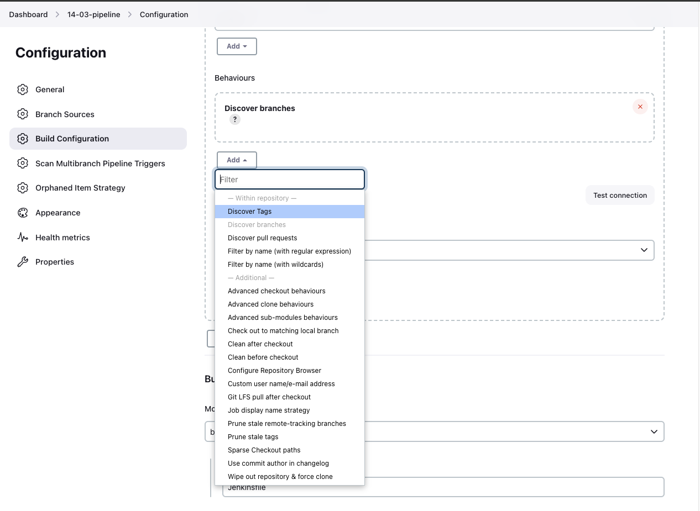
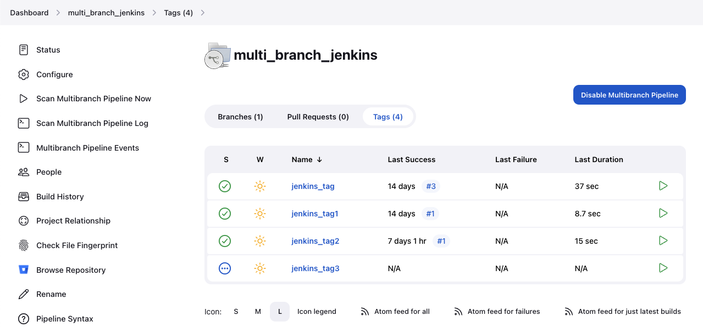

# Tags Discovery Behavior for Multibranch Pipeline Jobs

## Overview
As of version 4.X.X of this plugin, we have added a new tag discovery behavior for Multibranch Pipeline jobs. 
This behavior allows the job to discover tags in Bitbucket Data Center.

:warning: This change will only discover tags. We currently do not support automatic tag builds.

## Configuration
To enable this new feature, simply follow the steps below:

1. Navigate to your Jenkins instance and open the configuration page for your Multibranch Pipeline job.
2. Go to the "Branch Sources -> Bitbucket Server" section.
3. Under "Behaviors", click "Add" and then select "Discover tags". This will enable the job to discover tags in your Bitbucket Server.
   
6. You should now be able to see tags for the specified repository.
   